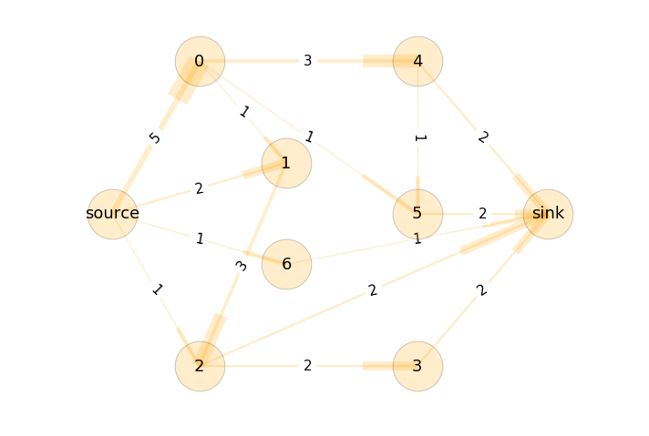
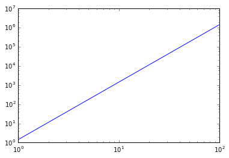
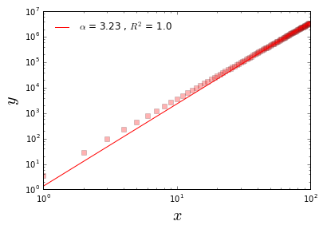
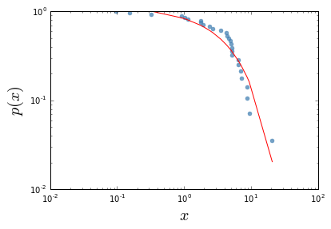
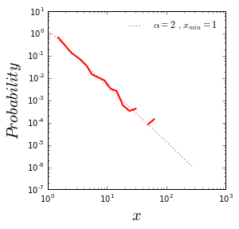
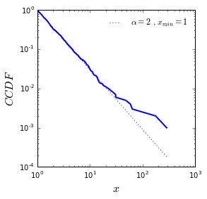
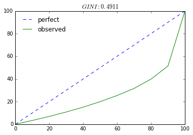

# flownetwork

A python package for flow network analysis https://pypi.python.org/pypi/flownetwork

## install the most updated github version

```python
pip install -U git+https://github.com/chengjun/flownetwork.git
```

## install and upgrade

Open a terminal, and input:


```python
pip install flownetwork
```

if your want to ungrade to a new version, just input:

```python
pip install --upgrade flownetwork
```

if your want to uninstall, please input:

```python
pip uninstall flownetwork
```

## import

```python
# import packages
import flownetwork.flownetwork as fn
import networkx as nx
import matplotlib.pyplot as plt

print(fn.__version__)

```

    $version = 3.0.9$


## flow network analysis

```python
help(fn.constructFlowNetwork)
```

    Help on function constructFlowNetwork in module flownetwork.flownetwork:

    constructFlowNetwork(C)
        C is an array of two dimentions, e.g.,
        C = np.array([[user1, item1],
                      [user1, item2],
                      [user2, item1],
                      [user2, item3]])
        Return a balanced flow network


```python
# constructing a flow network
demo = fn.attention_data
gd = fn.constructFlowNetwork(demo)
```

```python
# drawing a demo network
fig = plt.figure(figsize=(12, 8),facecolor='white')
pos={0: np.array([ 0.2 ,  0.8]),
 2: np.array([ 0.2,  0.2]),
 1: np.array([ 0.4,  0.6]),
 6: np.array([ 0.4,  0.4]),
 4: np.array([ 0.7,  0.8]),
 5: np.array([ 0.7,  0.5]),
 3: np.array([ 0.7,  0.2 ]),
 'sink': np.array([ 1,  0.5]),
 'source': np.array([ 0,  0.5])}
width=[float(d['weight']*1.2) for (u,v,d) in gd.edges(data=True)]
edge_labels=dict([((u,v,),d['weight']) for u,v,d in gd.edges(data=True)])
nx.draw_networkx_edge_labels(gd,pos,edge_labels=edge_labels, font_size = 15, alpha = .5)
nx.draw(gd, pos, node_size = 3000, node_color = 'orange',
        alpha = 0.2, width = width, edge_color='orange',style='solid')
nx.draw_networkx_labels(gd,pos,font_size=18)
plt.show()
```




```python
nx.info(gd)
```


    'Name: \nType: DiGraph\nNumber of nodes: 9\nNumber of edges: 15\nAverage in degree:   1.6667\nAverage out degree:   1.6667'


```python
# balancing the network
# if it is not balanced
gh = fn.flowBalancing(gd)
nx.info(gh)
```


    'Name: \nType: DiGraph\nNumber of nodes: 9\nNumber of edges: 15\nAverage in degree:   1.6667\nAverage out degree:   1.6667'


```python
# flow matrix
m = fn.getFlowMatrix(gd)
m
```


    matrix([[ 0.,  1.,  0.,  0.,  3.,  1.,  0.,  0.,  0.],
            [ 0.,  0.,  3.,  0.,  0.,  0.,  0.,  0.,  0.],
            [ 0.,  0.,  0.,  2.,  0.,  0.,  0.,  0.,  2.],
            [ 0.,  0.,  0.,  0.,  0.,  0.,  0.,  0.,  2.],
            [ 0.,  0.,  0.,  0.,  0.,  1.,  0.,  0.,  2.],
            [ 0.,  0.,  0.,  0.,  0.,  0.,  0.,  0.,  2.],
            [ 0.,  0.,  0.,  0.,  0.,  0.,  0.,  0.,  1.],
            [ 5.,  2.,  1.,  0.,  0.,  0.,  1.,  0.,  0.],
            [ 0.,  0.,  0.,  0.,  0.,  0.,  0.,  0.,  0.]])


```python
fn.getMarkovMatrix(m)
```


    array([[ 0.        ,  0.2       ,  0.        ,  0.        ,  0.6       ,
             0.2       ,  0.        ,  0.        ,  0.        ],
           [ 0.        ,  0.        ,  1.        ,  0.        ,  0.        ,
             0.        ,  0.        ,  0.        ,  0.        ],
           [ 0.        ,  0.        ,  0.        ,  0.5       ,  0.        ,
             0.        ,  0.        ,  0.        ,  0.5       ],
           [ 0.        ,  0.        ,  0.        ,  0.        ,  0.        ,
             0.        ,  0.        ,  0.        ,  1.        ],
           [ 0.        ,  0.        ,  0.        ,  0.        ,  0.        ,
             0.33333333,  0.        ,  0.        ,  0.66666667],
           [ 0.        ,  0.        ,  0.        ,  0.        ,  0.        ,
             0.        ,  0.        ,  0.        ,  1.        ],
           [ 0.        ,  0.        ,  0.        ,  0.        ,  0.        ,
             0.        ,  0.        ,  0.        ,  1.        ],
           [ 0.55555556,  0.22222222,  0.11111111,  0.        ,  0.        ,
             0.        ,  0.11111111,  0.        ,  0.        ],
           [ 0.        ,  0.        ,  0.        ,  0.        ,  0.        ,
             0.        ,  0.        ,  0.        ,  0.        ]])


```python
fn.getUmatrix(gd)
```


    matrix([[ 1.        ,  0.2       ,  0.2       ,  0.1       ,  0.6       ,
              0.4       ,  0.        ],
            [ 0.        ,  1.        ,  1.        ,  0.5       ,  0.        ,
              0.        ,  0.        ],
            [ 0.        ,  0.        ,  1.        ,  0.5       ,  0.        ,
              0.        ,  0.        ],
            [ 0.        ,  0.        ,  0.        ,  1.        ,  0.        ,
              0.        ,  0.        ],
            [ 0.        ,  0.        ,  0.        ,  0.        ,  1.        ,
              0.33333333,  0.        ],
            [ 0.        ,  0.        ,  0.        ,  0.        ,  0.        ,
              1.        ,  0.        ],
            [ 0.        ,  0.        ,  0.        ,  0.        ,  0.        ,
              0.        ,  1.        ]])


```python
# return dissipationToSink,totalFlow,flowFromSource

fn.networkDissipate(gd)
```


    defaultdict(<function flownetwork.flownetwork.<lambda>>,
                {0: [0, 5, 5],
                 1: [0, 3, 2],
                 2: [2, 4, 1],
                 3: [2, 2, 0],
                 4: [2, 3, 0],
                 5: [2, 2, 0],
                 6: [1, 1, 1]})


```python
# flow distance
fn.flowDistanceFromSource(gd)
```


    {0: 1.0,
     1: 1.333333333333333,
     2: 2.0,
     3: 3.0,
     4: 2.0,
     5: 2.5,
     6: 1.0,
     'sink': 3.2222222222222214}


```python
fn.outflow(gd, 1)
```


    3


```python
fn.inflow(gd, 1)
```


    3


```python
fn.averageFlowLength(gd)
```


    3.2222222222222223


```python
# fn.getAverageTimeMatrix(gd)
```


## Plot

```python
fig = plt.figure(figsize=(9, 9),facecolor='white')
ax = fig.add_subplot(111)
fn.plotTree(gd,ax)
plt.show()
```


```python
from random import random
x = np.array(range(1, 100))
y = (x+random()*x)**3

plt.plot(x, y)
plt.xscale('log');plt.yscale('log')
plt.show()
```





```python
fn.alloRegressPlot(x,y,'r','s','$x$','$y$', loglog=True)
```





```python
rg = np.array([ 20.7863444 ,   9.40547933,   8.70934714,   8.62690145,
     7.16978087,   7.02575052,   6.45280959,   6.44755478,
     5.16630287,   5.16092884,   5.15618737,   5.05610068,
     4.87023561,   4.66753197,   4.41807645,   4.2635671 ,
     3.54454372,   2.7087178 ,   2.39016885,   1.9483156 ,
     1.78393238,   1.75432688,   1.12789787,   1.02098332,
     0.92653501,   0.32586582,   0.1514813 ,   0.09722761])
fn.powerLawExponentialCutOffPlot(rg, '$x$', '$p(x)$')
```


    [-0.0099301962503268171,
     -0.064764460567964449,
     -0.17705123513352666,
     0.89999847894045781]





```python
fn.DGBDPlot(rg)
```


```python
from networkx.utils import powerlaw_sequence
pl_sequence = powerlaw_sequence(1000,exponent=2.5)

fig = plt.figure(figsize=(4, 4),facecolor='white')
ax = fig.add_subplot(111)
fn.plotPowerlaw(pl_sequence,ax,'r','$x$')

```

    Calculating best minimal value for power law fit





```python
fig = plt.figure(figsize=(4, 4),facecolor='white')
ax = fig.add_subplot(111)
fn.plotCCDF(pl_sequence,ax,'b','$x$')

```

    Calculating best minimal value for power law fit





```python
bins, result, gini_val = fn.gini_coefficient(np.array(pl_sequence))

plt.plot(bins, bins, '--', label="perfect")
plt.plot(bins, result, label="observed")
plt.title("$GINI: %.4f$" %(gini_val))

plt.legend(loc = 0, frameon = False)
plt.show()
```



